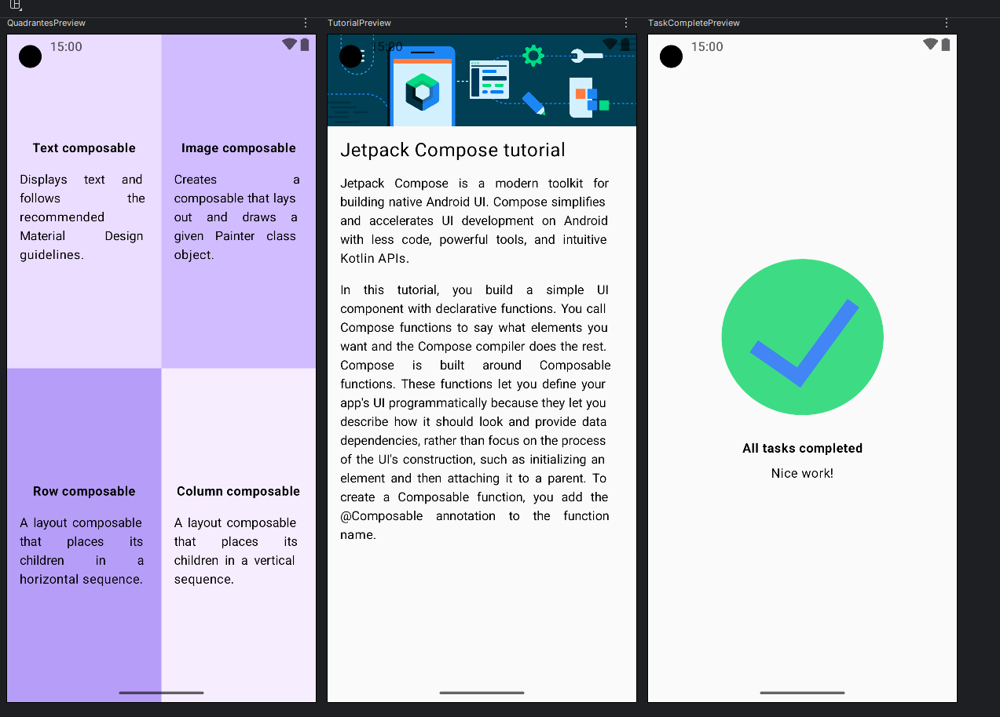
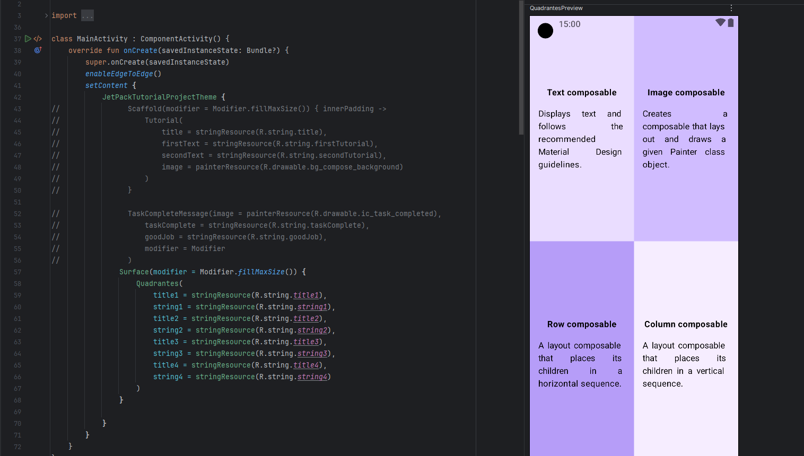

# Android Compose Challenge 1

## What is this about?

The gist of the project was to do the practice exercises from the [android official course](https://developer.android.com/codelabs/basic-android-kotlin-compose-composables-practice-problems?continue=https%3A%2F%2Fdeveloper.android.com%2Fcourses%2Fpathways%2Fandroid-basics-compose-unit-1-pathway-3&hl=pt-br#0). We were asked to create three basic layouts for an App Screen using Android Studio and Kotlin.

## Screenshots

## How it was done

The course provided us with the basic images, color and string values, and layout configurations. We had only to set the elements up nicely on the screen. Even so, it was challenging to set up some of the elements correctly.

## What we learned

The hierarchy of the elements is very important in trying to set up an ideal layout. JetPack Compose utilizes a very simple design philosophy: think of the screen as built of blocks of columns, rows and boxes. Combining them enables the developer to create very complex layouts. 